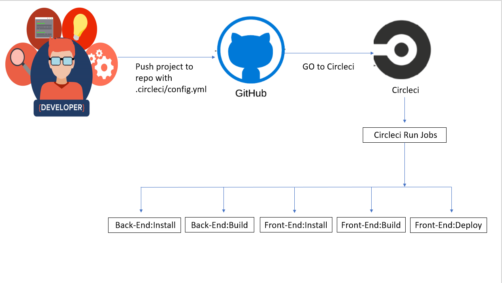

## Udagram Pipeline

### Continuous Integration
#### CircleCI
CircleCI reads the `.circleci/config.yml` file 
there are 6 jobs to be run by CircleCI.
- **Back-End Install**: Runs the `npm run backend:install` script given in the `package.json` file

- **Back-End Build**: Runs the `npm run backend:build` script given in the `package.json` file

- **Back-End Deploy**: Runs the `npm run backend:deploy` script given in the `package.json` file

- **Front-End Install**: Runs the `npm run frontend:install` script given in the `package.json` file

- **Front-End Build**: Runs the `npm run frontend:build` script given in the `package.json` file

- **Front-End Deploy**: Runs the `npm run frontend:deploy` script given in the `package.json` file
